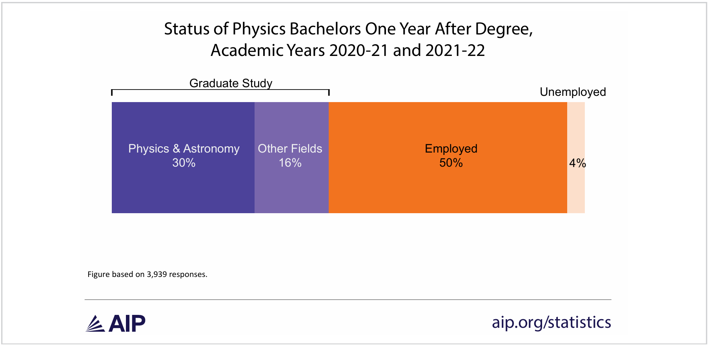

## Welcome to PHYS 4604

This course is built around a simple idea: **professional development happens by doing it.**

Over the semester, we will produce five real documents you can use immediately -- in job applications, graduate school applications, fellowship applications, and career fairs.

### Course websites:

- https://canvas.gatech.edu/
- https://ajsteinmetz.github.io/gt-phys-4604/

::: notes
Welcome students. This course is intentionally low-overhead — one credit, one hour per week, no exams. The deliverables are the point. Emphasize that the résumé they write is one they can hand to an employer in three weeks.
:::

---

## Where do B.S. Physics go nationally?

{fig-align="center" width="85%"}

::: {style="font-size: 0.6em; text-align: center; color: #555; margin-top: 4px;"}
[@mulvey2025]
:::

---

## B.S. Physics Starting Salaries

```{python}
#| echo: false
#| fig-align: center
#| out-width: "90%"
import matplotlib
import matplotlib.pyplot as plt
import numpy as np

matplotlib.rcParams.update({'font.family': 'sans-serif'})

years  = ['2020–21', '2021–22', '2022–23', '2023–24', '2024–25']
x      = np.arange(len(years))
width  = 0.25

oae    = [74.0,   80.0,  76.5,   86.5,   84.0]
# winter = [67.0,   74.0,  72.5,   74.05,  85.0,   87.0  ]
summer = [67.834, 70.0,  64.776, 74.563, np.nan]

fig, ax = plt.subplots(figsize=(9, 3.8))

ax.bar(x, oae,    width, label='B.S. (GT OAE)',         color='#003057', edgecolor='black', linewidth=0.5)
# ax.bar(x,         winter, width, label='B.S. (NACE prelim.)', color='#EAAA00', edgecolor='black', linewidth=0.5)
ax.bar(x + width, summer, width, label='B.S. (NACE)',   color='#C45000', edgecolor='black', linewidth=0.5)

ax.set_xlabel('Academic Year', fontsize=10)
ax.set_ylabel('Median salary ($k)', fontsize=10)
ax.set_xticks(x)
ax.set_xticklabels(years, fontsize=9)
ax.set_ylim(60, 95)
ax.set_yticks(range(60, 96, 5))
ax.yaxis.grid(True, linestyle='--', alpha=0.55, color='gray')
ax.set_axisbelow(True)
ax.legend(loc='upper center', bbox_to_anchor=(0.5, 1.15),
          ncol=3, frameon=False, fontsize=9)
ax.spines['top'].set_visible(False)
ax.spines['right'].set_visible(False)

plt.tight_layout()
plt.show()
```

::: {style="font-size: 0.55em; text-align: center; color: #555; margin-top: 2px;"}
[@nace_winter; @nace_summer; @oae_gt]
:::

---

## What You Will Produce This Semester

| Assignment | Due Date | Weight |
|---|---|---|
| Résumé | September 11 | 10% |
| Online professional presence (LinkedIn) | October 2 | 4% |
| Research proposal, GRFP style | October 23 | 15% |
| Personal statement or cover letter | November 20 | 15% |
| External participation | December 4 | 4% |
| Attendance and participation | Weekly | 52% |

Each assignment produces something real — not a class exercise.

---

## Course Policies — The Short Version

- **Attendance is mandatory.** One missed class is dropped from your attendance grade.
- **No textbook.** Materials are provided through Canvas.
- **Limited AI use is permitted** — but must be disclosed with an AI Usage Statement.
- **Late work is not accepted.** All assignments are open the entire semester, so plan ahead.
- **When in doubt, ask.** Email or office hours — I'd rather you ask than guess.

---

## Part I: The Career Fair

### Fall 2026 All Majors Career Fair

Dates: **September 14–15, 2026**

---

## The Career Fair Is Seventeen Days Away

The **Fall 2026 All Majors Career Fair** is September 14–15 at Georgia Tech.

Your **résumé is due September 11** — before the fair begins.

This is not a practice run. Recruiters and employers from dozens of companies will be there. Physics, engineering, data science, and research roles are all represented.

::: {.highlight-box}
**The goal of today's lecture:** you leave knowing what goes on a résumé and how to start writing one.
:::

---

## What Happens at a Career Fair

- You approach a company table with your résumé in hand.
- You introduce yourself in 30–60 seconds (an "elevator pitch").
- You have a brief conversation about your background and interest.
- They take your résumé — or tell you where to apply online.

You do not need to have everything figured out. You need to be **prepared, professional, and specific** about what you are looking for.

::: notes
Reassure students that career fairs are not as intimidating as they seem. Preparation is the key differentiator. A student who walks up with a polished résumé and can articulate their interests will stand out.
:::

---

## Part II: Résumés

What they are, what goes in them, and how to write them well.

---

## Résumé vs. Academic CV

| | Résumé | Academic CV |
|---|---|---|
| **Length** | 1–2 pages | No limit; grows over time |
| **Purpose** | Fit for a specific role | Full academic and professional record |
| **Used for** | Jobs, internships, most undergrad opportunities | Grad fellowships, faculty positions, postdocs |
| **Customization** | Tailored to each application | Updated over time |

For most of you, right now: **résumé**.

A CV will come later — often during graduate school, as publications, talks, and grants accumulate.

---

## The Six Main Sections

A résumé is typically organized into six sections:

1. **Contact information**
2. **Education**
3. **Experience**
4. **Skills**
5. **Projects and leadership**
6. Awards and honors *(optional)*

Not every résumé looks the same. The order and emphasis depend on your background and the opportunity.

---

## Contact Information

Make this easy to find — usually at the top of the page.

- Full name (prominent — consider a slightly larger font)
- Professional email address (GT email is fine)
- Phone number
- LinkedIn profile URL
- GitHub or portfolio URL (if you have one worth sharing)
- City and state — no full street address needed

::: notes
Mention that GT email is appropriate for now but a permanent personal email is useful long-term. LinkedIn URL should be customized (linkedin.com/in/yourname) rather than the default random string.
:::

---

## Education

- **Georgia Institute of Technology**
  - B.S. Physics / Astrophysics / Applied Physics (or joint degree)
  - Expected graduation: May 2027 (or your actual date)
  - GPA: include if ≥ 3.0 — judgement call
- Relevant coursework (optional, useful if experience is thin)
- Academic honors: Dean's List, PURA, scholarships

List your most recent degree first. If you attended another institution, include it.

---

## Experience

The most important section for most employers.

Include: **work, research, internships, co-ops, teaching assistantships**

For each entry:

- Organization name and your role or title
- Dates — month and year (e.g., May 2025 – Aug. 2025)
- Location (city, state) — or "Remote"
- **2–4 bullet points describing what you did and what it produced**

::: notes
Research experience counts strongly for physics students — faculty advisors, national labs, REUs. Emphasize that even a one-semester research role is worth including if it involved real technical work.
:::

---

## Writing Strong Bullets

The most common mistake: **describing duties instead of accomplishments.**

| Weak | Strong |
|---|---|
| Helped with research in the lab | Analyzed detector calibration data in Python; results incorporated into weekly group reports |
| Responsible for data analysis | Developed signal-processing pipeline in MATLAB, reducing analysis time by 40% |
| Worked on simulations | Implemented Monte Carlo simulation of particle trajectories in C++; validated against published results |

Lead with a **strong action verb**. Quantify where you can.

---

## Strong Action Verbs

Use these to open your bullet points:

**Research and Analysis**
Analyzed · Modeled · Simulated · Measured · Characterized · Derived · Validated

**Development and Implementation**
Built · Designed · Developed · Implemented · Programmed · Automated · Optimized

**Communication and Collaboration**
Presented · Wrote · Documented · Led · Collaborated · Mentored · Coordinated

Avoid: *assisted with*, *helped*, *was responsible for*, *worked on*

---

## Skills

List technical skills — the specific tools and languages you actually know.

**Programming and Software**
Python, MATLAB, C/C++, Julia, Mathematica, LaTeX, Git, Linux/bash

**Laboratory and Instrumentation**
(List specific instruments, techniques, or equipment relevant to your work)

**Other**
Data analysis, scientific writing, numerical methods

::: {.highlight-box}
Do not list generic software (Word, PowerPoint) unless the role specifically requires it.
:::

---

## Projects and Leadership

Valuable if work or research experience is limited — and worth including even if it is not.

**Technical projects**

- Computational or experimental class projects with real results
- Independent projects, open-source contributions

**Leadership and service**

- Club officers, SPS (Society of Physics Students), outreach programs
- Teaching or peer tutoring roles

Describe these the same way you describe experience: action verb, specific contribution, result if possible.

---

## Formatting

Keep it clean and professional.

- **One page** for most undergraduates (two pages with substantial experience)
- Consistent fonts — one or two at most; no smaller than 10 pt for body text
- Adequate white space — do not cram everything in
- Consistent alignment of dates and section headers
- No photos, no graphics, no colored text (with rare exceptions)
- **Always submit as a PDF** — never a Word document unless specifically requested

::: notes
The GT Career Center has résumé templates on their website. Encourage students to use one if they are starting from scratch. The formatting rules exist because recruiters scan résumés in seconds.
:::

---

## What Not to Do

Common mistakes to avoid:

- **Vague bullets:** "Assisted with research" — what research? what did you do?
- **Passive constructions:** "Was responsible for..." — use an active verb instead
- **Inconsistent formatting:** mixed date styles, misaligned margins, two fonts that clash
- **Wrong file format:** emailing a `.docx` when PDF was requested
- **One-size-fits-all:** not tailoring the résumé for the specific opportunity

Typos and grammar errors are disqualifying. Proofread. Then proofread again.

---

## Upcoming Schedule

::: {.nonincremental}
1. **Start your résumé draft** — or revisit the one you have.
2. **Bring it to class next Friday (September 4)** — we will workshop drafts in class.
3. **Résumé is due: September 11 at 11:59 PM ET** — submitted as PDF to Canvas.
4. **Career Fair: September 14–15** — plan to attend.
:::

The GT Career Center offers drop-in résumé reviews. Use them before September 11.

---

## Helpful Resources

**Résumé and Career Preparation**

- [Georgia Tech Career Center — Résumé Guidance](https://career.gatech.edu/resumes/)
- [Georgia Tech Career Fair](https://careerfair.gatech.edu/)
- [Georgia Tech Interviewing Resources](https://career.gatech.edu/interviewing/)

**Course Materials (Canvas)**

- *Résumé vs. Academic CV* — supplemental guide
- *Technical and Professional Writing* — supplemental guide
- *How to Format an AI Usage Statement*

**Office Hours:** By appointment — email [ajsteinmetz@gatech.edu](mailto:ajsteinmetz@gatech.edu) to schedule.

---

## References

::: {#refs}
:::
