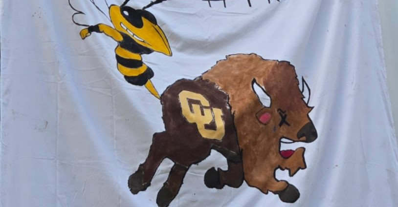
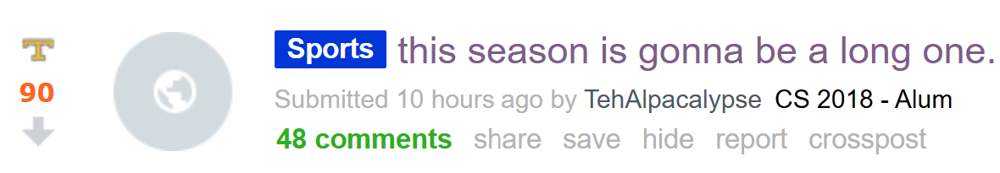

## Upcoming

| What | When | Points |
|---|---|---|
| [Résumé](../assignments/resume.qmd) — PDF to Canvas | Sept. 11, 11:59 PM ET | 100 (10%) |
| GT Career Center résumé reviews | Sept. 8 in person · Sept. 9–10 virtual | — |
| Career paths with a physics degree | Sept. 11 | — |
| **Fall 2026 All Majors Career Fair** | Sept. 14–15 | — |
| [Online professional presence](../assignments/online-profile.qmd) | Sept. 25 | 4% |

::: {.highlight-box}
**Today is a peer review workshop.** We will trade documents and provide feed back to one another.
:::

---

## Meanwhile, on Thursday Night

:::: {.columns}
::: {.column width="44%"}
{fig-align="center" width="100%"}
:::
::: {.column width="56%"}
{fig-align="center" width="85%"}

{fig-align="center" width="85%"}
:::
::::

{fig-align="center" width="75%"}

---

## CareerBuzz

Georgia Tech's official platform for job and internship postings, career fair registration, and on-campus interviews.

- Browse job and internship postings targeted at GT students
- Register for the Fall 2026 All Majors Career Fair
- Schedule on-campus interviews with recruiting employers
- Sign up for GT Career Center workshops and events

**[https://career.gatech.edu/careerbuzz/](https://career.gatech.edu/careerbuzz/)**

::: {.highlight-box}
**Spotlight Postings** are a curated feed of vetted, high-quality opportunities — a good place to start if endless scrolling isn't your thing.

**[https://career.gatech.edu/spotlight-postings/](https://career.gatech.edu/spotlight-postings/)**
:::

---

## Fall 2026 All Majors Career Fair

**September 14–15** · Georgia Tech

A little prep beforehand is what makes it worth attending.

- Research which employers are attending and prioritize a short list: check the employer list and schedule on **Career Fair Plus**
- Bring several printed copies of your résumé
- Prepare a short self-introduction (your "elevator pitch")
- Dress professionally

**[https://career.gatech.edu/fall-all-majors-career-fair-student-info/](https://career.gatech.edu/fall-all-majors-career-fair-student-info/)**

---

## Your Elevator Pitch

A recruiter conversation has two parts; don't front-load everything into a monologue (you're not Hamlet).

1. **Opening.** Name, major, and year. Make clear whether you're looking for an internship or full-time role. Add one line on why you're interested in their industry, have a genuine question for them.
2. **If they ask for more.** Tell a short, specific story: what you did, the skills you used, and the result. Close by relating it to what they're hiring for.

::: {.highlight-box}
Write **bullet points**, not a script. Practice saying it out loud until it sounds like you, not something memorized.
:::

---

## Career Fair Etiquette

- **Dress for the most formal employer in the room.** If in doubt, business professional. GT's [Campus Closet](https://career.gatech.edu/campus-closet/) lends professional attire for free.
- **Arrive early.** Recruiters talk to hundreds of students; you'll get a better conversation at 10 AM than at 3:45 PM.
- **Don't linger, and don't interrupt.** Keep the line moving; wait your turn even for a quick question.
- **Silence your phone.**
- **Talking to a recruiter isn't the same as applying.** Get their guidance on where to formally apply; the conversation itself doesn't count as an application.

---

## After the Fair

- **Note names, titles, and any contact info** from every conversation. Even without an email, a name and title is enough to find someone on LinkedIn.
- **Send a short thank-you within 24–48 hours.** Reference something specific you discussed; keep it brief.
- **It's fine to send a LinkedIn connection request** to someone you spoke with directly.
- **Still apply online.** A good conversation at the fair is marketing and networking, not a substitute for the formal application.

