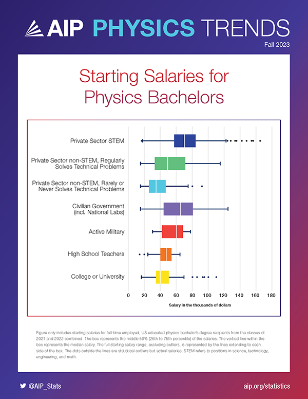

## Upcoming

| What | When | Points |
|---|---|---|
| [Resume](../assignments/resume.qmd) &mdash; PDF to Canvas | **Tonight**, Sept. 11, 11:59 PM ET | 100 (10%) |
| **Fall 2026 All Majors Career Fair** | Sept. 14&ndash;15 | External participation |
| [Online professional presence](../assignments/online-profile.qmd) | Sept. 25 | 4% |
| [Research proposal, GRFP style](../assignments/research-proposal.qmd) | Oct. 9 | 15% |

::: {.highlight-box}
**The goal of today's lecture:** map out what people *actually* do with a physics, astrophysics, or applied physics degree, using national data from AIP, APS, and BLS.
:::

---

## Part I: Physics bachelors entering the workforce

More than half of new physics bachelors who take a job start in the private sector.

```{python}
#| echo: false
#| fig-align: center
import matplotlib
import matplotlib.pyplot as plt
import numpy as np

matplotlib.rcParams.update({'font.family': 'sans-serif'})

sectors = ['Private sector', 'College or university', 'Other',
           "Civilian gov't / national lab", 'High school', 'Active military']
pct     = [56, 13, 11, 10, 7, 3]
colors  = ['#003057', '#5588BB', '#8C8C8C', '#C45000', '#2e7d32', '#996633']

y = np.arange(len(sectors))

fig, ax = plt.subplots(figsize=(12, 4.5))

ax.barh(y, pct, color=colors, edgecolor='black', linewidth=0.5)
for yi, p in zip(y, pct):
    ax.text(p + 0.8, yi, f'{p}%', va='center', fontsize=16)

ax.set_yticks(y)
ax.set_yticklabels(sectors, fontsize=16)
ax.invert_yaxis()
ax.set_xlabel('Percent of employed physics bachelors (%)', fontsize=18)
ax.set_xlim(0, 65)
ax.tick_params(axis='x', labelsize=16)
ax.xaxis.grid(True, linestyle='--', alpha=0.55, color='gray')
ax.set_axisbelow(True)
ax.spines['top'].set_visible(False)
ax.spines['right'].set_visible(False)

plt.tight_layout()
plt.show()
```

::: {.cite-note style="margin-top: -0.5em;"}
Classes of 2022&ndash;23 and 2023&ndash;24 &middot; [@aip_bs_sectors2026]
:::

---

## What do private-sector physics bachelors do?

:::: {.columns}
::: {.column width="50%"}
| Field of private-sector job | Share |
|---|---|
| **Engineering** | 38% |
| **Computer or information systems** | 26% |
| All other fields | 36% |
:::
::: {.column width="50%"}
Nearly two-thirds work in **engineering or computing**.

Only **3%** of employed physics bachelors said they work in physics or astronomy.
:::
::::

::: {.highlight-box}
Your competition is engineering and CS majors. Sell your problem-solving and modeling toolkit **on your resume**.
:::

::: {.cite-note}
Classes of 2017 and 2018 &middot; [@mulvey_porter2021]
:::

---

## Common job titles for new physics bachelors

::: {style="font-size: 0.9em;"}
| Category | Job titles reported by new physics bachelors |
|---|---|
| **Engineering** | Systems, Electrical, Mechanical, Test, Process, Design, Application Engineer; Engineering Technician |
| **Software** | Software Engineer/Developer, Data Engineer, Data Analyst, Data Scientist, ML Engineer, Consultant |
| **Research** | Research Assistant, Research Technician, Patent Examiner, Accelerator Operator, Physicist, Scientist |
| **Education** | High School Physics/Math Teacher, Middle School Science Teacher, Tutor |
| **Business** | Data Analyst, Research Analyst, Project Manager, Investment Banker |

: {tbl-colwidths="[18,82]"}
:::

::: {.highlight-box}
As discussed last week, at the career fair (or CareerBuzz), search for these titles, not "physicist."
:::

::: {.cite-note}
Classes of 2021 and 2022 &middot; [@aip_bs_titles2024]
:::

---

## Starting salaries for physics bachelors

:::: {.columns}
::: {.column width="45%"}
{fig-align="center" width="80%"}
:::
::: {.column width="55%"}
- Private-sector STEM: highest median and widest range
- Civilian government (incl. national labs): next highest
- Non-STEM jobs that regularly solve technical problems pay more than those that don't
- Teaching and university jobs: lower pay, narrower range
:::
::::

::: {.cite-note}
Full-time, U.S.-educated graduates, classes of 2021 and 2022. [@aip_bs_salaries2023]
:::

---

## Astronomy & astrophysics bachelors

:::: {.columns}
::: {.column width="50%"}
**One year after the degree**

- **42%** were enrolled in graduate school, mostly in astronomy, physics, or astrophysics.
- Among those employed, the **private sector** was the largest employer (**40%**).
- **Colleges and universities** employed about a quarter.
:::
::: {.column width="50%"}
**Median starting salary**

| Sector | Median |
|---|---|
| Private-sector STEM | $68,500 |
| College or university | $41,600 |

::: {.highlight-box}
Same pattern as physics bachelors: grad school or industry, with industry paying the most.
:::
:::
::::

::: {.cite-note}
Classes of 2021&ndash;22 through 2023&ndash;24 &middot; [@aip_astro_bs]
:::

---

## Physics vs. Astrophysics vs. Applied Physics

Same core training. Your electives, research, and projects give direction.

| Degree | Natural first-job directions | How to signal it |
|---|---|---|
| **Physics** | Research & technical, software/data, grad school | Research, computational projects |
| **Applied Physics** | Engineering (systems, test, optics), national labs | Lab & instrumentation skills |
| **Astrophysics** | Data science, software, aerospace, grad school | Large-dataset projects, Python |

: {tbl-colwidths="[20,45,35]"}

::: {.highlight-box}
**These are tendencies, not rules.** Employers hire on skills and experience, so your resume matters more than the name on your diploma.
:::

---

## Part II: "Physicist" as a job title

:::: {.columns}
::: {.column width="55%"}
| Physicists & astronomers | |
|---|---|
| **Median pay (May 2025)** | $166,880 |
| **Jobs (2025)** | 25,600 |
| **Projected growth, 2025&ndash;35** | 7% |
| **Openings per year** | ~1,500 |
| **Typical entry education** | Doctoral degree |
:::
::: {.column width="45%"}
**Largest employers of physicists**

- Scientific R&D services: 38%
- Federal government: 13%
- Colleges and universities: 10%
:::
::::

::: {.cite-note}
[@bls_physicists]
:::

---

## Where physics skills get hired

| Occupation | Median pay | Entry education | Growth | Openings/yr[^openings] |
|---|---|---|---|---|
| Software developers | $135,980 | Bachelor's | 10% | ~106,100 |
| Aerospace engineers | $134,960 | Bachelor's | 8% | ~3,800 |
| Data scientists | $120,230 | Bachelor's | 35% | ~24,800 |
| High school teachers | $72,040 | Bachelor's | 0% | ~63,500 |
| Physicists & astronomers | $166,880 | Doctoral | 7% | ~1,500 |

: {tbl-colwidths="[32,17,19,13,19]"}

[^openings]: Total openings; not just physicists of course.

::: {.highlight-box}
BLS medians cover all experience levels*; they are not starting salaries.
:::

::: {.cite-note}
Median pay as of May 2025; projected growth 2025&ndash;35. [@bls_software; @bls_aerospace; @bls_datasci; @bls_hsteachers; @bls_physicists]
:::

---

## Part III: The graduate school path

One year after the degree, new physics PhDs split roughly evenly between **postdocs** and **potentially permanent** positions.

```{python}
#| echo: false
#| fig-align: center
import matplotlib
import matplotlib.pyplot as plt
import numpy as np

matplotlib.rcParams.update({'font.family': 'sans-serif'})

status = ['Postdoc', 'Potentially\npermanent', 'Other\ntemporary', 'Unemployed']
pct    = [50, 43, 5, 2]
colors = ['#003057', '#C45000', '#2e7d32', '#8C8C8C']

x = np.arange(len(status))

fig, ax = plt.subplots(figsize=(12, 4.5))

ax.bar(x, pct, 0.55, color=colors, edgecolor='black', linewidth=0.5)
for xi, p in zip(x, pct):
    ax.text(xi, p + 1.2, f'{p}%', ha='center', fontsize=16)

ax.set_ylabel('Percent of new PhDs (%)', fontsize=18)
ax.set_xticks(x)
ax.set_xticklabels(status, fontsize=16)
ax.set_ylim(0, 60)
ax.set_yticks(range(0, 61, 10))
ax.tick_params(axis='y', labelsize=16)
ax.yaxis.grid(True, linestyle='--', alpha=0.55, color='gray')
ax.set_axisbelow(True)
ax.spines['top'].set_visible(False)
ax.spines['right'].set_visible(False)

plt.tight_layout()
plt.show()
```

::: {.cite-note style="margin-top: -0.5em;"}
Classes of 2020&ndash;21 and 2021&ndash;22; U.S.-educated PhDs who remained in the U.S. (n = 1,680) &middot; [@aip_phd2024]
:::

---

## Where do new physics PhDs work?

:::: {.columns}
::: {.column width="50%"}
| Sector | Postdoc | Potentially permanent |
|---|---|---|
| Academic | 72% | 15% |
| Private | 1% | **73%** |
| Government | 24% | 7% |
| Other | 3% | 5% |
:::
::: {.column width="50%"}
**63%** of potentially permanent positions are in fields *outside* physics:

- Data science: 21%
- Engineering: 14%
- Computer software: 11%
- Other fields: 17%
:::
::::

::: {.highlight-box}
Most permanent PhD jobs are in **industry**, not faculty positions.
:::

::: {.cite-note}
Classes of 2020&ndash;21 and 2021&ndash;22 &middot; [@aip_phd2024]
:::

---

## Is the PhD "worth it"?

:::: {.columns}
::: {.column width="60%"}
**PhDs in potentially permanent positions**

| % who felt&hellip; | Acad. | Private | Gov't |
|---|---|---|---|
| PhD is appropriate background | 90 | 86 | 82 |
| Professionally challenging | 73 | 83 | 89 |
| Underemployed | 28 | 17 | 14 |
| Satisfied overall | 73 | 89 | 96 |

: {tbl-colwidths="[49,17,17,17]"}
:::
::: {.column width="40%"}
**Postdocs**

- **97%** say their skills will be valuable later
- **91%** are satisfied
- **56%** consider academia their primary goal

**Academic prospects?**

There's about 2000/yr new PhDs and about 600/yr faculty positions.

:::
::::

::: {.cite-note}
Classes of 2020&ndash;21 and 2021&ndash;22 &middot; [@aip_phd2024]
:::

---

## Part IV: How industry careers progress

A physics bachelor usually starts in an **entry-level or junior** position and advances with experience. At the senior level, the path often splits in two:

:::: {.columns}
::: {.column width="50%"}
### Technical track

- Deepen your technical expertise
- Lead the technical work on projects
- Stay close to the science and engineering
:::
::: {.column width="50%"}
### Managerial track

- Spend most of your time on project, resource, and personnel management
- High-level management positions are among the **highest-paid** jobs for physicists in the private sector
:::
::::

::: {.cite-note}
[@aps_bs_private]
:::

---

## Job boards

:::: {.columns}
::: {.column width="50%"}
### Physics & Academia

- [APS Physics Jobs](https://www.apsphysicsjobs.com/): academia, labs, and industry
- [Physics Today Jobs](https://jobs.physicstoday.org/): physics and related fields
- [AcademicJobsOnline](https://academicjobsonline.org/ajo): postdoc and faculty positions
- [AAS Job Register](https://aas.org/jobregister): astronomy and astrophysics
- [INSPIRE Jobs](https://inspirehep.net/jobs): high-energy physics research positions
:::
::: {.column width="50%"}
### Industry & Government

- [LinkedIn Jobs](https://www.linkedin.com/jobs/): industry and networking
- [CareerBuzz](https://career.gatech.edu/careerbuzz/): GT jobs and internships
- [USAJOBS](https://www.usajobs.gov/): federal jobs, including entry-level physicist roles
- [Hacker News Jobs](https://news.ycombinator.com/jobs): Y Combinator startups
:::
::::

---

## References {.scrollable}

::: {#refs style="font-size: 0.7em;"}
:::
