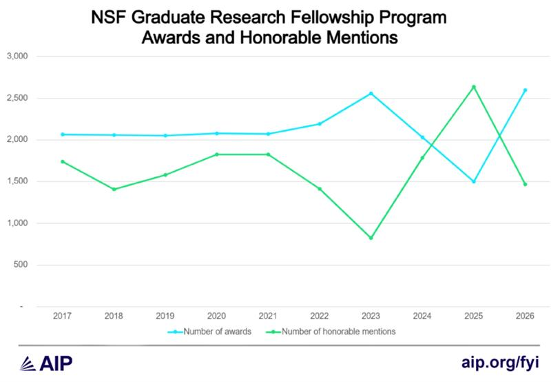

## Upcoming

| What | When | Points |
|---|---|---|
| [Online professional presence](../assignments/online-profile.qmd) | **Tonight**, Sept. 25, 11:59 PM ET | 4% |
| [Research proposal, GRFP style](../assignments/research-proposal.qmd) | Oct. 9, 11:59 PM ET | 15% |
| **NSF GRFP reference letters** | Oct. 16, 8:00 PM ET | &ndash; |
| **NSF GRFP deadline** &ndash; Physics & Astronomy | Oct. 23, 8:00 PM ET | &ndash; |

::: {.highlight-box}
**The goal of today's lecture:** understand what the NSF Graduate Research Fellowship is, whether you are eligible, and what the application actually asks you to write because the [research proposal](../assignments/research-proposal.qmd) due Oct. 9 is the GRFP's research plan in miniature.
:::

---

## Aside: Reaching out to someone you don't know

> I actually used the exact technique discussed today to email a professor and ask if she had some time to help me understand how to start doing research. She invited me to come to campus to talk, and by the end of the meeting she'd offered me a position.

Cold emails with small "asks" can be successful.

> I was in San Francisco and went to a networking power night. I spoke to a quiet older gentleman next to me and he ended up being a GT physics alum! He was actively hiring physicists for his company. We kept in contact and he has since tried to hire me.

You never know where a random conversation will lead.

---

## Aside: The network you already have

> I reached out to a person running a start-up that I knew from playing frisbee with him, and he gave me an internship that has turned into a full-time job after graduation.

Nobody at that frisbee game was "networking." And yet...

> I met a graduating member of SPS through their Discord channel. He got me in contact with his research mentor, as he was looking for someone to take over his project. I now do research with their group.

Your peers are also part of your network, just like your professors, friends, family, coworkers, etc.

---

## Aside: What the four have in common

| | Where it started | What was asked for | What came back |
|---|---|---|---|
| 1 | A cold email | 30 minutes of advice | A research position |
| 2 | Standing next to someone | Conversation | A standing job offer |
| 3 | A frisbee game | An internship | A full-time job |
| 4 | A club Discord | An introduction | An inherited research project |

::: {style="text-align: center;"}
"Networking" is just corpo-talk for "being a social human being".

Be social!
:::

---

## Part I: What the GRFP is

:::: {.columns}
::: {.column width="55%"}
| | |
|---|---|
| **Annual stipend** | $37,000 |
| **Cost-of-education allowance** | $16,000 to the institution |
| **Years of support** | 3, used within a 5-year period |
| **Total value** | ~$159,000 |
| **Awards anticipated this cycle** | 1,500 |
:::
::: {.column width="45%"}
The fellowship follows **you**, not a project or an advisor.

That independence is the real value: you can change advisor, change institution, or change topic and keep the funding.
:::
::::

::: {.cite-note}
Solicitation NSF 26-526, published August 25, 2026 &middot; [@nsf_grfp_solicitation]
:::

---

## How competitive is it?

:::: {.columns}
::: {.column width="52%"}
| Competition | Awards |
|---|---|
| 2025 | 1,000, then 500 more added later |
| 2026 | ~2,500 offers &ndash; an all-time high |
| **2027** | **1,500 anticipated** |

:::
::: {.column width="48%"}
Last spring's drew **nearly 14,000 applicants** for those ~2,500 offers. Final numbers still depend on congressional appropriations.

::: {.highlight-box}
Award counts have swung by a factor of two in three years. **Do not calibrate on last year's rate.**
:::
:::
::::

::: {.highlight-box}
Apply anyway: it is the same writing you need for graduate school, and the research plan becomes your statement of purpose.
:::

::: {.cite-note}
Applicant and 2026 offer counts: [@nsf_grfp_2026awards]. Award history and FY 2027 outlook: [@aip_grfp_fyi2026]. Anticipated 1,500 awards: [@nsf_grfp_solicitation].
:::

---

## A decade of awards and honorable mentions

:::: {.columns}
::: {.column width="68%"}
{fig-align="center" width="100%" fig-alt="Line chart of NSF GRFP awards and honorable mentions, 2017 to 2026. Awards hold near 2,050 from 2017 to 2021, rise to about 2,550 in 2023, fall to roughly 1,500 in 2025, and rebound to about 2,600 in 2026. Honorable mentions move opposite, dropping to about 825 in 2023, peaking near 2,650 in 2025, and falling to about 1,450 in 2026."}
:::
::: {.column width="32%"}
::: {.highlight-box}
Honorable mentions are unfunded, but recognized as high-quality proposals worthy of putting on your CV.
:::
:::
::::

::: {.cite-note}
Figure from [@aip_grfp_fyi2026]
:::

---

## Are you eligible?

You are likely eligible if you are a **senior applying to start graduate school next fall**.

- U.S. citizen, national, or permanent resident at the time of submission
- Intending to enroll full-time in a **research-based (thesis) master's or doctoral** program in an NSF-supported field
- Have completed **less than one academic year** in a graduate program

::: {.highlight-box}
Once you are a graduate student, you may apply **only once** &ndash; and second-year graduate students are not eligible at all. Applying now does not use up that attempt.
:::

::: {.cite-note}
[@nsf_grfp_eligibility; @nsf_grfp_solicitation]
:::

---

## Part II: What you actually submit

| Component | Length | What it is |
|---|---|---|
| **Personal, Relevant Background and Future Goals** | 2-3 pages | Who you are, how you got here, where you're going |
| **Graduate Research Plan** | 2 pages | A specific research question and how you'd attack it |
| **Reference letters** | 3 letters | Due **Oct. 16, 8:00 PM ET**, one week before your deadline |
| Transcripts | &ndash; | From every institution attended |

: {tbl-colwidths="[38,14,48]"}

::: {.highlight-box}
The [research proposal](../assignments/research-proposal.qmd) due **Oct. 9** is the Graduate Research Plan. If you are applying this year, write the real one.
:::

::: {.cite-note}
[@nsf_grfp_solicitation]
:::

---

## Letters are your top priority right now

Everything else is under your control. **The letters are not.**

:::: {.columns}
::: {.column width="50%"}
- Letters are due **Oct. 16, 8:00 PM ET** one week *before* your app.
- Faculty write many of these every fall, and they all come due the same week
:::
::: {.column width="50%"}
- You must name **three** writers
- You may designate **up to five**
- NSF uses the top three of your preference that arrive
:::
::::

::: {.highlight-box}
Start asking your letter-writers **now**. Do not delay.
:::

::: {.cite-note}
[@nsf_grfp_solicitation]
:::

---

## How to ask &ndash; this upcoming week

:::: {.columns}
::: {.column width="46%"}
**The ask itself**

> Are you able to write me a strong letter of rec. for the NSF GRFP? Letters are due Oct. 16.

Give them room to say no; don't take it personally if they decline.
:::
::: {.column width="54%"}
**Send a packet with the ask**

- Your resume or CV
- Your draft research plan (even if simple) and personal statement
- *Specifically* what you did with them: course, project, semester, result

:::
::::

Due to time, an incomplete "packet" is better than nothing.

Then send one reminder a week out, and thank them afterward.

---

## References {.scrollable}

::: {#refs style="font-size: 0.7em;"}
:::
