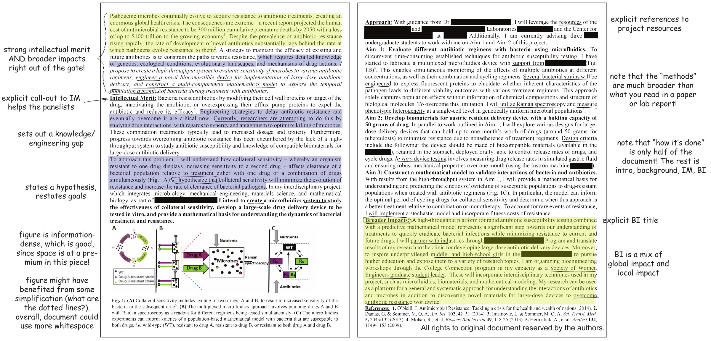
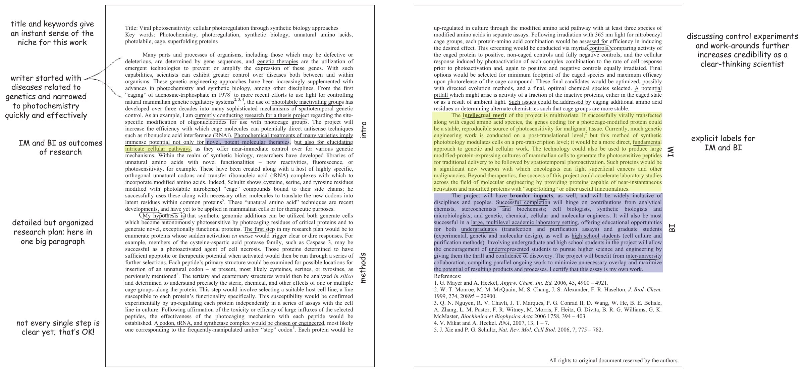
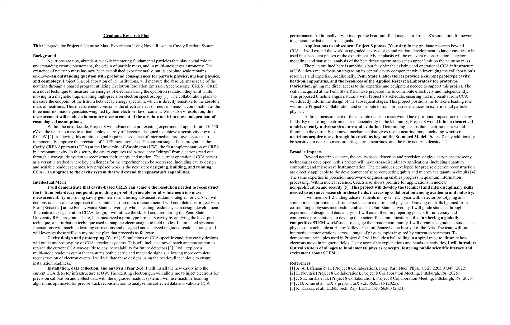
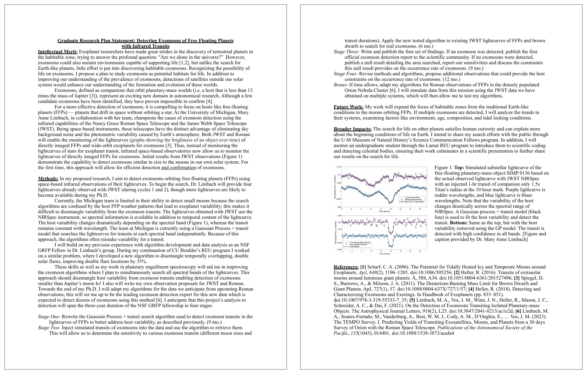

## Upcoming

| What | When | Points |
|---|---|---|
| [Research proposal, GRFP style](../assignments/research-proposal.qmd) | Oct. 9, 11:59 PM ET | 15% |
| **NSF GRFP reference letters** | Oct. 16, 8:00 PM ET | &ndash; |
| **NSF GRFP deadline** &ndash; Physics & Astronomy | Oct. 23, 8:00 PM ET | &ndash; |

::: {.highlight-box}
**The goal of today's lecture:** turn the [research proposal](../assignments/research-proposal.qmd) due Oct. 9 from a topic you like into two pages a reviewer can score.
:::

---

## The two review criteria

Every reviewer scores you on exactly two things.

:::: {.columns}
::: {.column width="50%"}
### Intellectual Merit

**Your** potential to **advance knowledge**.

- Is the question worth asking?
- Can **you** carry it out?
:::
::: {.column width="50%"}
### Broader Impacts

**Your** potential to **benefit society**.

- Outreach, teaching, mentoring
- Broadening participation in STEM
- Applications beyond your subfield
:::
::::

::: {.highlight-box}
**Broader Impacts is where most physics applications fail.** It is not a paragraph you append at the end. Write it into both documents.
:::

::: {.cite-note}
[@nsf_grfp_solicitation]
:::

---

## Intellectual Merit

NSF's criterion is "the potential to advance knowledge." The GRFP applies it to **the applicant**. Reviewers may weigh your ability to:

:::: {.columns}
::: {.column width="50%"}
- Plan and conduct research
- Work independently and on a team
- Interpret and communicate research
- Take initiative and think creatively
:::
::: {.column width="50%"}
- Solve problems
- Persist and overcome challenges
- Show intellectual ability: grades, coursework, awards
:::
::::

::: {.highlight-box}
Your research plan is evidence for this list. A clear, feasible plan shows you can plan research; the writing shows you can communicate it.
:::

::: {.cite-note}
NSF 26-526, Section VI.A &middot; [@nsf_grfp_solicitation]
:::

::: notes
Section VI.A gives the NSB definitions, then lists these factors as what reviewers "will consider in assessing potential Intellectual Merit of the application," framed as the applicant's ability. Broader Impacts is framed the same way: "the likelihood that the applicant's activities will..."

The how-to-apply page still describes the Research Plan's Intellectual Merit section in project terms ("advance knowledge in your field"), so students need both: the project is worth doing, and they can do it.
:::

---

## A proposal is not a summary of a field

A literature review tells the reader what is known. A proposal names **one open question** and commits to attacking it.

:::: {.columns}
::: {.column width="50%"}
**A topic**

> I want to study dark matter using galaxy rotation curves.

What would you actually doon a workday?
:::
::: {.column width="50%"}
**A question**

> Can archival rotation curves tell a cored halo from a cuspy one?

Names the data, the sample, and the measurement.
:::
::::

::: {.highlight-box}
Can't say what you'd measure/calculate? Then it's a topic, not a question.
:::

---

## The structure that fits in two pages

::: {style="font-size: 0.85em;"}
| Section | What it does |
|---|---|
| **Title** | Names the question, not the subfield |
| **Motivation / Background** | Why this problem, why now |
| **Research Question or Objective** | The one thing you commit to |
| **Approach / Methods** | How you would actually do it |
| **Intellectual Merit** | Required heading |
| **Broader Impacts** | Required heading |
| **References** | **Count against** the two pages |

: {tbl-colwidths="[38,62]"}
:::

::: {.highlight-box}
Use the exact headings **Intellectual Merit** and **Broader Impacts**, kept separate, in *both* statements.
:::

::: {.cite-note}
[@nsf_grfp_howtoapply; @nsf_grfp_solicitation]
:::

---

## Where your two pages go

:::: {.columns}
::: {.column width="55%"}
| Section | Rough budget |
|---|---|
| Title and Motivation | ~1/2 page |
| Research Question | 2&ndash;3 sentences |
| Approach / Methods | ~3/4 page |
| Intellectual Merit | ~1/4 page |
| Broader Impacts | ~1/4 page |
| References | ~1/4 page |
:::
::: {.column width="45%"}
**Over two pages? Cut in this order:**

1. Background the reviewer already knows
2. References that only pad
3. Method details beyond what shows feasibility
:::
::::

::: {.highlight-box}
My rule of thumb: **methods get the most space.** Never cut the question or Broader Impacts.
:::

---

## Writing Intellectual Merit

The reviewer's question: **is this worth doing, and can you do it?**

- **The gap:** what is not known, and a citation showing it is not
- **The approach:** why your method can close that gap
- **You:** what you have already done that shows you can do this (a technique, instrument, code, or result)
- **The scope:** feasible for an early graduate student with a mentor
- **The payoff:** what the field learns if it works, and if it does not

::: {.highlight-box}
Feasible beats ambitious. A project that can work in three years scores better than a field-changing idea that cannot.
:::

---

## Writing Broader Impacts

**Done beats promised.** "I will do outreach" is weak. "I have tutored for three years and will extend that to &hellip;" is strong.

:::: {.columns}
::: {.column width="50%"}
**Common sources in physics**

- Outreach and public engagement
- Open software, tools, and data
- Mentoring and teaching
- Applications: energy, health, infrastructure
:::
::: {.column width="50%"}
**Make it concrete**

- **Who** benefits?
- **How many**, and how often?
- **How would you know** it worked?
- Why are **you** the one to do it?
:::
::::

::: {.highlight-box}
Tie it to your research and to what you have already done.
:::

---

## Write for a reviewer outside your subfield

Reviewers know your broad field, not necessarily your subfield. NSF advises: do not be overly technical; explain your rationale.

:::: {.columns}
::: {.column width="50%"}
**Do**

- Say why it matters, in plain words
- Define every acronym
- Explain *why* before *how*
:::
::: {.column width="50%"}
**Don't**

- Use your group's shorthand
- Assume they know the key paper
- Spend lines on derivations
:::
::::

::: {.highlight-box}
Could a physicist from another subfield explain your question back to you?
:::

::: {.cite-note}
[@nsf_grfp_howtoapply; @mit_commlab_grfp]
:::

---

## Make the page skimmable

A reviewer reads many applications. Assume the first pass is a skim.

- **Bold the research question** so it can be found in seconds
- Start each paragraph with its point; details follow
- Short paragraphs and white space, not a wall of text
- Use the section headings from the structure slide
- One figure at most, and only if it replaces a paragraph

::: {.highlight-box}
If a reviewer read only your headings, your bold text, and your first sentences, would they know what you are proposing?
:::

More in the [technical writing guide](../supplemental/technical-writing.qmd).

---

## Sentence-level style

| Instead of | Write |
|---|---|
| It is hoped that this research could potentially help&hellip; | This work will test whether&hellip; |
| Measurements will be performed on the samples. | I will measure the samples' resistivity from 4 to 300 K. |
| A very novel and extremely important approach | An approach that resolves X, which Y cannot |
| A large dataset | 12,000 archival spectra |

: {tbl-colwidths="[50,50]"}

- **First person, active voice.** You are the one doing the work.
- **Future tense** for the plan; past tense for what you have already done.
- **Numbers and names** beat adjectives.

---

## Example: antibiotic resistance

{fig-align="center" width="100%" fig-alt="Two pages of a winning NSF GRFP research proposal on a microfluidics system for studying antibiotic resistance, with handwritten-style annotations in the margins. Annotations note that it states Intellectual Merit and Broader Impacts right away, calls out Intellectual Merit with an explicit heading, sets out a knowledge gap, states a hypothesis, uses an information-dense figure, has an explicit Broader Impacts title, and spends only half the document on methods."}

::: {.cite-note}
Copyright &copy; by the Authors &middot; Source: [@mit_commlab_grfp]
:::

---

## Example: viral photosensitivity

{fig-align="center" width="100%" fig-alt="Two pages of a winning NSF GRFP research proposal on photocaged proteins for light-controlled cell therapies, with margin annotations. Annotations note that the title and keywords set the niche, the introduction narrows quickly from genetic disease to photochemistry, the hypothesis is stated explicitly, the research plan is detailed but organized, control experiments and pitfalls add credibility, and Intellectual Merit and Broader Impacts are labeled in bold within their paragraphs."}

::: {.cite-note}
Copyright &copy; by the Authors &middot; Source: [@mit_commlab_grfp]
:::


---

## Example: neutrino mass with Project 8

{fig-align="center" height="600px" fig-alt="Two pages of a winning NSF GRFP Graduate Research Plan proposing CCA+, an upgraded resonant-cavity readout for the Project 8 neutrino mass experiment. It has a title line, then bold headings for Background, Intellectual Merit, and Broader Impacts, a year-by-year plan with bold run-in labels, key sentences in bold, and a short numbered reference list."}

::: {.cite-note}
Copyright &copy; by Rachel White &middot; Source: [@grfphelp]
:::

---

## Example: exomoon astrophysics

{fig-align="center" height="600px" fig-alt="Two pages of a winning NSF GRFP Graduate Research Plan on detecting exomoons around free-floating planets using JWST and Roman infrared lightcurves. Underlined headings for Intellectual Merit, Methods, Future Work, and Broader Impacts; a four-stage timeline with months per stage; a two-panel lightcurve figure with a caption; and a compact run-in reference list."}

::: {.cite-note}
Copyright &copy; by Brooke Kotten &middot; Source: [@grfphelp]
:::


---

## What NSF enforces

::: {style="font-size: 0.85em;"}
| Rule | Requirement |
|---|---|
| **Length** | 2 pages, **including references and figures** |
| **Page** | 8.5 &times; 11 in., PDF only |
| **Margins** | 1 in. on all sides, **with nothing in them**: no header, footer, name, or page number |
| **Font** | Times New Roman or Computer Modern, &ge; 11 pt; Arial, Courier New, or Palatino Linotype, &ge; 10 pt |
| **Spacing** | At least single-spaced (about 6 lines per inch) |
| **Exceptions** | Smaller text only in equations, figures, tables, and captions |
| **Headings** | **Intellectual Merit** and **Broader Impacts**, separate |

: {tbl-colwidths="[20,80]"}
:::

::: {.highlight-box}
LaTeX puts a page number in the bottom margin by default. That breaks the margin rule. Turn it off.
:::

::: {.cite-note}
[@nsf_grfp_howtoapply; @nsf_grfp_solicitation]
:::

---

## Setting it up in LaTeX

:::: {.columns}
::: {.column width="55%"}
```latex
\documentclass[11pt,letterpaper]{article}
\usepackage[margin=1in]{geometry}
\pagestyle{empty}  % no page numbers

\begin{document}
...
\section*{Intellectual Merit}
...
\section*{Broader Impacts}
...
\begin{thebibliography}{9}
...
\end{thebibliography}
\end{document}
```
:::
::: {.column width="45%"}
**Do not cheat the page limit**

- No `\linespread` below 1
- No negative `\vspace`
- No body text below 11 pt

Reviewers notice a crammed page.

Start from the [starter template](../course-files/research-proposal-latex/phys-4604-research-proposal-template.tex). New to LaTeX? [Learn LaTeX in 30 minutes](https://www.overleaf.com/learn/latex/Learn_LaTeX_in_30_minutes).
:::
::::

---

## Advice and examples from past applicants

::: {style="font-size: 0.85em;"}
- [NSF GRFP Help](https://grfphelp.github.io/): winning essays, including the 2026 cycle
- [Alex Lang: NSF Fellowship](https://www.alexhunterlang.com/nsf-fellowship): a detailed guide and a table of successful essays
- [Claire McKay Bowen: Advice on Applying](https://clairemckaybowen.com/fellowship/#application-components): each application component
- [Rachel White: Guide to Graduate School Applications](https://white3792.github.io/rachels-complete-guide-to-graduate-school-applications/): a physics applicant's statements
- [MIT CommKit: NSF GRFP Research Proposal](https://mitcommlab.mit.edu/broad/commkit/nsf-research-proposal/): today's annotated examples
:::

::: {.highlight-box}
Rules change. Check every example against the current NSF requirements before you copy its format.
:::

---

## References {.scrollable}

::: {#refs style="font-size: 0.7em;"}
:::
